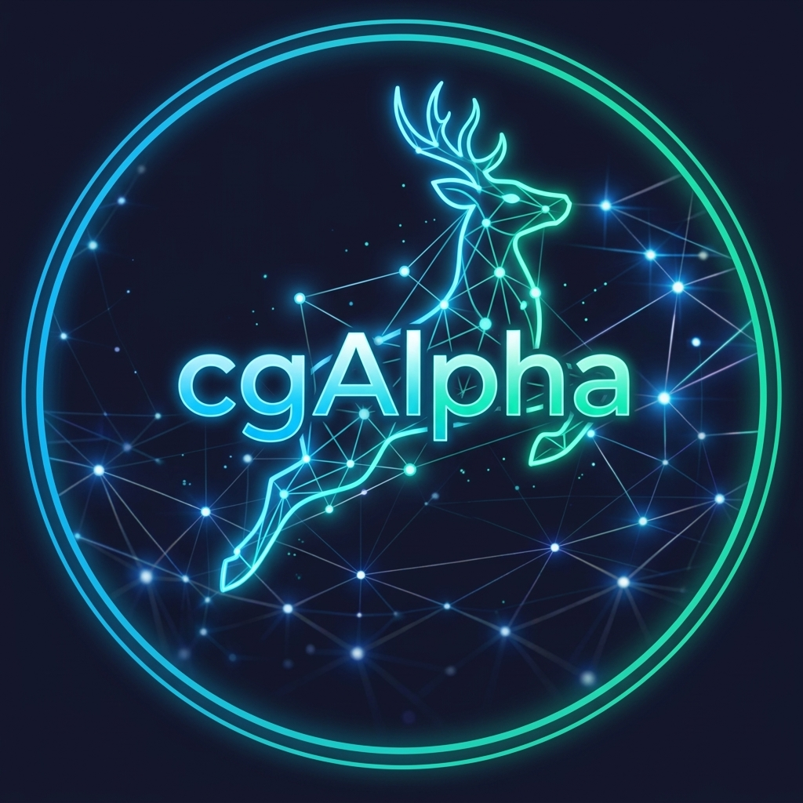

<p align="center">
  
</p>

<h1 align="center">cgAlpha_0.0.1 — White Paper</h1>
<p align="center"><em>Causal Graph Alpha · Documento vivo mantenido por Lila</em></p>
<p align="center"><em>Última actualización: 26 de abril de 2026 · Versión: v4-oracle-hardened</em></p>

---

## 1. Qué es cgAlpha_0.0.1

cgAlpha (Causal Graph Alpha) es un sistema de trading algorítmico diseñado para operar BTCUSDT en Binance. Su objetivo no es maximizar beneficios a corto plazo — es construir un sistema que **aprenda de sus propios errores y mejore autónomamente** bajo supervisión humana.

### Principios fundacionales

1. **Evidencia sobre opinión:** Cada decisión del sistema se basa en datos Out-of-Sample (OOS), nunca en la "intuición" del LLM.
2. **Autonomía gradual:** El sistema puede proponer mejoras. El humano aprueba o rechaza. Con evidencia acumulada, la autonomía se amplía.
3. **Honestidad radical:** Si algo no funciona, se documenta como bug con número, no se esconde.
4. **Determinismo primero:** Para decisiones factuales se usa código determinista (grep, AST). Los LLMs solo intervienen en análisis cualitativos.

## 2. Arquitectura actual

```
                    ┌─────────────────────────┐
                    │    FUENTE DE DATOS       │
                    │    Binance Vision API    │
                    │    BTCUSDT klines 5m     │
                    └────────────┬────────────┘
                                 │
                                 ▼
                    ┌─────────────────────────┐
                    │  DETECCIÓN DE SEÑALES    │
                    │  TripleCoincidenceDetector│
                    │  979 líneas             │
                    │                         │
                    │  Zonas de soporte/resis. │
                    │  → Retests monitoreados  │
                    │  → Features de micro-    │
                    │    estructura (VWAP,      │
                    │    OBI, CumDelta)        │
                    └────────────┬────────────┘
                                 │
                                 ▼
                    ┌─────────────────────────┐
                    │  ORÁCULO (ML)           │
                    │  OracleTrainer_v3        │
                    │  RandomForest            │
                    │  Meta-Labeling           │
                    │                         │
                    │  Estado: ✅ Operativo    │
                    │  8/8 bugs resueltos     │
                    └────────────┬────────────┘
                                 │
                                 ▼
                    ┌─────────────────────────┐
                    │  EJECUCIÓN              │
                    │  ShadowTrader           │
                    │  DryRunOrderManager     │
                    │                         │
                    │  Modo: paper trading    │
                    │  Registro: bridge.jsonl │
                    └────────────┬────────────┘
                                 │
                                 ▼
              ┌──────────────────────────────────────┐
              │        CANAL DE EVOLUCIÓN            │
              │                                      │
              │  ChangeProposer ──┐                  │
              │  ExperimentRunner ┼→ Orchestrator v4 │
              │  AutoProposer ────┘  → CodeCraftSage │
              │                                      │
              │  3 categorías de propuestas:          │
              │  Cat.1: Automática (parámetros)      │
              │  Cat.2: Semi-automática (aprobación)  │
              │  Cat.3: Supervisada (sesión humana)   │
              │                                      │
              │  Estado: ✅ 4 islas conectadas        │
              └──────────────────────────────────────┘
```

### Componentes y estado

| Componente | Fichero principal | Líneas | Estado |
|---|---|---|---|
| TripleCoincidenceDetector | `infrastructure/signal_detector/triple_coincidence.py` | 979 | ✅ Operativo |
| OracleTrainer_v3 | `lila/llm/oracle.py` | 357 | ✅ Operativo — 8/8 bugs resueltos |
| ShadowTrader | `trading/shadow_trader.py` | ~200 | ✅ Operativo |
| Pipeline | `application/pipeline.py` | 353 | ✅ Operativo — reentrena en ciclo vivo |
| AutoProposer | `lila/llm/proposer.py` | ~140 | ✅ Conectado al Orchestrator |
| ChangeProposer | `application/change_proposer.py` | 93 | ✅ Conectado al Orchestrator |
| CodeCraftSage | `lila/codecraft_sage.py` | 247 | ✅ Conectado al Orchestrator |
| ExperimentRunner | `application/experiment_runner.py` | 507 | ✅ Conectado al Orchestrator |
| EvolutionOrchestrator v4 | `lila/evolution_orchestrator.py` | 724 | ✅ Hub central activo |
| MemoryPolicyEngine | `learning/memory_policy.py` | 515 | ✅ Persistencia + IDENTITY + guards |

## 3. La Simple Foundation Strategy

cgAlpha_0.0.1 opera una única estrategia: la **Simple Foundation Strategy**.

### Pipeline operativo

1. **Detección de zonas:** El TripleCoincidenceDetector identifica zonas de soporte/resistencia usando key candles, zonas de acumulación y mini-tendencias.
2. **Monitoreo de retests:** Cuando el precio vuelve a una zona, se capturan features de microestructura en el punto exacto del retest.
3. **Predicción del Oracle:** El modelo RandomForest (meta-labeling) evalúa si el retest será exitoso (BOUNCE o BREAKOUT).
4. **Ejecución shadow:** Si el Oracle aprueba con suficiente confianza, ShadowTrader registra la operación en `bridge.jsonl` (sin ejecución real).

### Parámetros principales

| Parámetro | Valor actual | Rango seguro | Efecto |
|---|---|---|---|
| `volume_threshold` | 1.2 | 0.8 – 2.0 | Filtro de zonas por volumen relativo |
| `quality_threshold` | 0.45 | 0.3 – 0.7 | Calidad mínima de señal |
| `min_oracle_confidence` | 0.70 | 0.60 – 0.90 | Confianza mínima para ejecutar |
| `zone_distance_candles` | 10 | 5 – 30 | Distancia entre zonas en velas |

> ⚠️ **Nota honesta:** El Sharpe de 1.13 reportado en documentación anterior (NORTH_STAR) no es verificable con datos OOS reales. No se ha completado un ciclo de validación walk-forward con el Oracle entrenado. Sin embargo, los 8 bugs del Oracle están resueltos, incluyendo train/test split (BUG-1), oversampling de clase minoritaria (BUG-3), outcome labeling con zona real (BUG-5) y reentrenamiento en ciclo vivo (BUG-6).

## 4. El canal de evolución

### Estado actual: 4 islas conectadas

El canal de evolución está completamente conectado:
- `AutoProposer` genera `TechnicalSpec` durante `Pipeline.run_cycle()` → Orchestrator
- `ChangeProposer` genera propuestas via GUI → Orchestrator (Island Bridge)
- `ExperimentRunner` envía resultados post-experimento → Orchestrator (Island Bridge)
- El Orchestrator clasifica Cat.1/2/3, persiste y expone endpoints de aprobación
- `CodeCraftSage` ejecuta cambios aprobados con pipeline: patch → test → git commit

### Las 3 categorías

| Categoría | Supervisión | Ejemplo | Tiempo estimado |
|---|---|---|---|
| **Cat.1 — Automática** | Ninguna (tests como barrera) | Ajustar `volume_threshold` de 1.2 → 1.3 | Segundos |
| **Cat.2 — Semi-automática** | Aprobación vía GUI | Añadir feature al Oracle | Minutos |
| **Cat.3 — Supervisada** | Sesión humana completa | Crear nueva herramienta | Horas |

### Archivos protegidos (Cat.3 obligatorio)

- `evolution_orchestrator.py`, `memory_policy.py`, `llm_switcher.py`
- `server.py`, `LILA_v3_NORTH_STAR.md`

### Pasos completados

1. ✅ Prompt Fundacional escrito (§0–§8)
2. ✅ ACCIÓN 1: IDENTITY memory + disk reload
3. ✅ ACCIÓN 2: LLM Switcher
4. ✅ ACCIÓN 3: Orchestrator v4
5. ✅ Oracle fixes BUG-1 a BUG-8 (todos resueltos)
6. ✅ Island Bridge: 4 islas conectadas al Orchestrator
7. ✅ production_ready dinámico con 4 checks runtime
8. ✅ Incidentes simulados separados del estado operativo

### Próxima etapa

1. 🔨 PASO 4: Parameter Landscape Map
2. 🔨 PASO 5: Mejora de CodeCraft Sage v4 (AST-based patching)
3. 🔨 Observar canal en operación real (24-48h de datos de mercado)

## 5. Bugs del Oracle — Registro completo

| Bug | Problema | Fix | Commit | Fecha |
|---|---|---|---|---|
| BUG-1 | Train/test sin split → accuracy inflada | `train_test_split` holdout 20% | `d0992d2` | 2026-04-20 |
| BUG-2 | Oracle sin persistencia en producción | `save_to_disk`/`load_from_disk` invocados | sesión anterior | 2026-04-20 |
| BUG-3 | Class imbalance 94/6 BOUNCE/BREAKOUT | Random oversampling solo en train set | `dd85d21` | 2026-04-26 |
| BUG-4 | Placeholder indistinguible de modelo real | `is_placeholder: bool` en OraclePrediction | `6d5c651` | 2026-04-26 |
| BUG-5 | Outcome labeling no usa zona real | `_determine_outcome()` usa zone_top/bottom | script determinista | 2026-04-20 |
| BUG-6 | Pipeline carga datos pero no reentrena | `train_model()` tras `load_training_dataset()` | `509c7b3` | 2026-04-26 |
| BUG-7 | Memoria no recarga al inicio | `load_from_disk()` al iniciar servidor | sesión anterior | 2026-04-20 |
| BUG-8 | Training Review approve/reject stubs | Persistencia en `training_approvals.jsonl` | `f3834ad` | 2026-04-20 |

## 6. Lecciones aprendidas

*Esta sección se actualiza después de cada reflexión crítica validada (§6).*

### Genesis — 19 abril 2026

Al construir el Prompt Fundacional, se identificaron y documentaron:
- **8 bugs funcionales** en el Oracle y la GUI (BUG-1 a BUG-8)
- **4 islas desconectadas** (AutoProposer, CodeCraftSage, ChangeProposer, ExperimentRunner)
- **57 correcciones** al propio prompt (C1–C57) — incluyendo 7 métodos fantasma y dependencias de rama no resueltas

La lección principal: **construir componentes capaces no es suficiente. Conectarlos es lo que crea un sistema.**

### Hardening — 26 abril 2026

Resolución de los 8 bugs del Oracle y conexión de las 4 islas:
- **Determinismo sobre LLM:** todos los fixes se aplicaron con scripts deterministas o edición directa verificada, nunca con generación LLM ciega.
- **Docs antes de código:** cada fix se documentó primero en NORTH_STAR (commit documental), luego se implementó (commit de código). Trazabilidad perfecta en git.
- **Guards preventivos:** `identity_confirmation` para nivel 5, `CAT_3_PROTECTED_FILES` para documentos fundacionales, `is_placeholder` para observabilidad.
- **production_ready dinámico:** 4 checks runtime reales en lugar de hardcode.

## 7. Changelog

| Fecha | Cat. | Cambio | Resultado |
|---|---|---|---|
| 2026-04-19 | — | Prompt Fundacional §0–§8 creado | 3113 líneas, 57 correcciones |
| 2026-04-19 | — | White paper genesis | Primera versión |
| 2026-04-20 | v4 | Pipeline enruta AutoProposer al Orchestrator | Canal runtime conectado |
| 2026-04-20 | v4 | White paper sincronizado con estado real | Bootstrap completado |
| 2026-04-20 | fix | BUG-1: train_test_split en Oracle | Métricas OOS reales |
| 2026-04-20 | fix | BUG-2: Oracle persistencia en disco | Modelo sobrevive reinicios |
| 2026-04-20 | fix | BUG-5: outcome labeling con zona real | Labels reflejan dinámica de zonas |
| 2026-04-20 | fix | BUG-7: memoria recarga desde disco | Conocimiento persistente entre sesiones |
| 2026-04-20 | fix | BUG-8: Training Review approve/reject | Curación de datos funcional |
| 2026-04-26 | fix | BUG-6: train_model() en pipeline cycle | Oracle reentrena en ciclo vivo |
| 2026-04-26 | fix | BUG-4: is_placeholder flag | Observabilidad placeholder vs modelo |
| 2026-04-26 | fix | BUG-3: oversampling clase minoritaria | Modelo aprende patrón BREAKOUT |
| 2026-04-26 | feat | Island Bridge: 4 islas conectadas | ChangeProposer + ExperimentRunner → Orchestrator |
| 2026-04-26 | chore | production_ready dinámico | 4 checks runtime reales |
| 2026-04-26 | chore | Incidentes simulados separados | Estado operativo limpio |
| 2026-04-26 | docs | WHITEPAPER actualizado (§2.6) | Estado real del proyecto |

*Entradas futuras se añaden automáticamente por el Orchestrator.*

## 8. Glosario

| Término | Definición |
|---|---|
| **bridge.jsonl** | Log de trades shadow: señal + ejecución + outcome |
| **Cat.1/2/3** | Categorías de propuesta de evolución (auto/semi/supervisada) |
| **CodeCraftSage** | Motor que parchea código, corre tests, y commitea en git |
| **drift** | Degradación del rendimiento del modelo detectada por AutoProposer |
| **evolution_log.jsonl** | Log de cambios al sistema (propuestas + resultado) |
| **IDENTITY** | Nivel 5 de memoria: inmutable, contiene el mantra |
| **Lila** | IA constructora de cgAlpha. Ejecuta prompts, propone mejoras |
| **mantra** | El Prompt Fundacional guardado en IDENTITY |
| **meta-labeling** | Técnica ML: el Oracle predice si una señal ya detectada tendrá éxito |
| **OOS** | Out-of-Sample: datos no vistos durante entrenamiento |
| **Oracle** | Modelo RandomForest que filtra señales por probabilidad |
| **Orchestrator** | Componente central que clasifica y enruta propuestas de evolución |
| **reflexión crítica** | Observación de Lila que cuestiona una parte del mantra con evidencia |
| **retest** | Cuando el precio vuelve a tocar una zona de soporte/resistencia |
| **ShadowTrader** | Ejecutor de trades en modo papel (sin dinero real) |
| **TechnicalSpec** | Dataclass que define un cambio concreto al código |
| **Triple Coincidence** | Detector de zonas basado en 3 confluencias técnicas |
| **walk-forward** | Validación temporal: entrenar en pasado, evaluar en futuro no visto |
| **zona** | Nivel de precio donde se detectó soporte o resistencia |

---

<p align="center">
  <em>Este documento es mantenido por Lila como parte de la orden permanente §2.6.</em><br/>
  <em>Se actualiza después de cada evolución del sistema.</em><br/>
  <em>cgAlpha_0.0.1 · Causal Graph Alpha</em>
</p>
