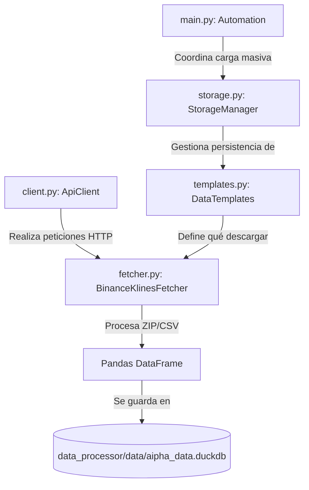

# Aipha Data Processor

Este documento proporciona una explicación técnica detallada del `data_system` de Aipha, diseñado para ser comprendido tanto por desarrolladores como por modelos de lenguaje (LLMs).

## 🎯 Propósito
El `data_system` es el motor de adquisición y persistencia de datos de Aipha. Su objetivo es descargar datos históricos de mercado (específicamente klines de Binance), procesarlos en DataFrames de Pandas y almacenarlos de forma eficiente en una base de datos local **DuckDB** para análisis posterior.

## 🏗️ Arquitectura y Flujo de Datos

El sistema sigue un diseño modular con separación clara de responsabilidades:



## 🧩 Componentes Detallados

### 1. `client.py` (ApiClient)
- **Función**: Cliente HTTP robusto basado en `requests.Session`.
- **Lógica**: Maneja reintentos, timeouts, cabeceras persistentes y streaming para descargas de archivos grandes.
- **Punto clave para LLMs**: Es agnóstico a la fuente de datos; solo se encarga de la capa de transporte.

### 2. `templates.py` (Data Contracts)
- **Función**: Define el "qué" se solicita.
- **Componentes**:
    - `BaseDataRequestTemplate`: Clase base abstracta con registro automático de subclases.
    - `KlinesDataRequestTemplate`: Define símbolo, intervalo, y rango de fechas (`start_date`, `end_date`).
- **Lógica**: Incluye métodos de serialización (`to_dict`, `from_dict`) para persistencia en JSON.

### 3. `fetcher.py` (BinanceKlinesFetcher)
- **Función**: El "cerebro" de la adquisición de datos.
- **Lógica**:
    1. Construye URLs para Binance Vision.
    2. Descarga archivos ZIP usando el `ApiClient`.
    3. Extrae y parsea CSVs directamente a DataFrames.
    4. Implementa una caché local en `data_processor/data/test_downloaded_data` para evitar descargas duplicadas.

### 4. `storage.py` (Persistence Layer)
- **Función**: Gestiona el almacenamiento a largo plazo.
- **DuckDB**: Utiliza DuckDB para persistencia analítica. Permite insertar DataFrames de Pandas de forma casi instantánea.
- **TemplateManager**: Guarda y carga las configuraciones de los templates en un archivo JSON (`data_processor/data/test_project_templates.json`).

### 5. `main.py` (Orchestration)
- **Función**: Punto de entrada para tareas automatizadas.
- **Lógica**: Permite la carga masiva de archivos CSV externos a DuckDB, facilitando la ingesta de datos de otras fuentes.

## 🚀 Cómo funciona el flujo completo (End-to-End)

1. **Definición**: Se crea un `KlinesDataRequestTemplate` con los parámetros deseados.
2. **Adquisición**: El `BinanceKlinesFetcher` descarga los días necesarios uno a uno.
3. **Consolidación**: Los datos se limpian y se concatenan en un único DataFrame.
4. **Persistencia**: `save_results_to_duckdb` inserta el DataFrame en la tabla correspondiente de DuckDB.
5. **Análisis**: Los datos están listos para ser consultados mediante SQL estándar sobre el archivo `.duckdb`.

## 📁 Estructura de Archivos

```
data_processor/
├── data_system/     # Código fuente (Módulo Python)
├── tests/           # Pruebas (Ver test_integration.py para ejemplo de uso)
├── docs/            # Reservado para documentación nueva del módulo
├── data/            # DuckDB, Caché de descargas y Templates JSON
├── requirements.txt # Dependencias (requests, pandas, duckdb)
└── logging_config.py# Configuración centralizada de logs
```

## 🛠️ Verificación
Para validar que todo el sistema funciona correctamente, ejecuta el test de integración:
```bash
python3 data_processor/tests/data_system/test_integration.py
```
Este test simula el flujo completo desde la descarga hasta la persistencia en DuckDB.

## ✅ Notas de Construcción (Consolidadas)

Este README absorbe la guía técnica histórica del módulo (`data_system`), incluyendo:
- arquitectura plana del core (`client`, `fetcher`, `templates`, `storage`, `main`),
- contrato de templates con serialización y registro automático,
- persistencia DuckDB + JSON de templates,
- prueba de integración como validación end-to-end.

La guía histórica se conserva únicamente como archivo de referencia en:
- `docs/archive/module_guides/data_processor_data_system.md`
