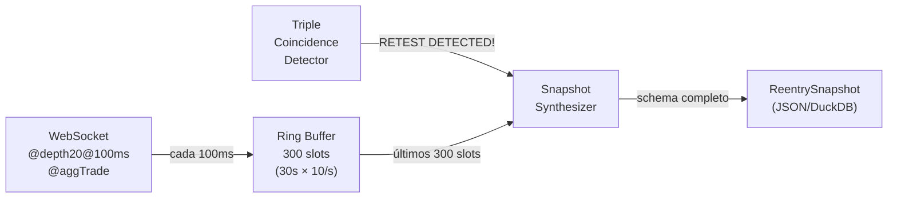
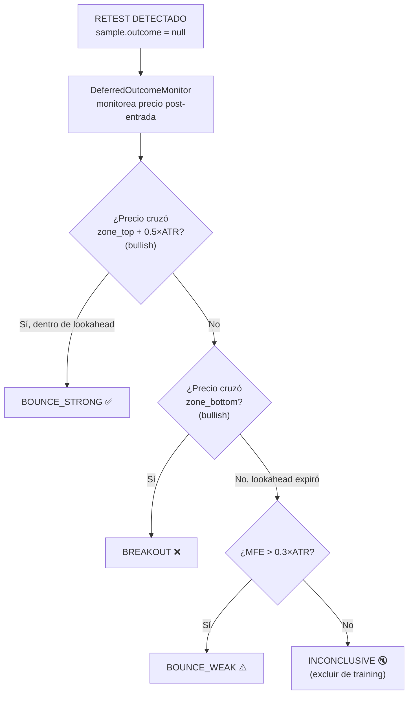
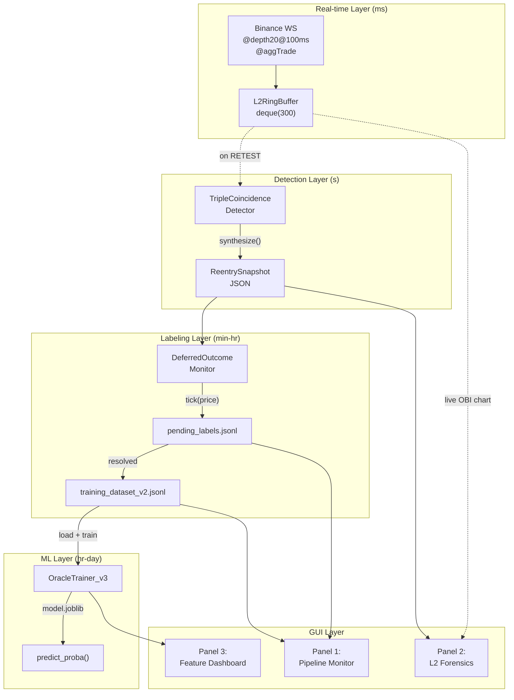
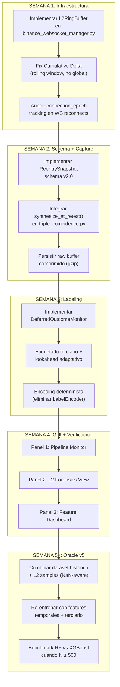

# Análisis Arquitectónico: El Alfa y Omega de la Ingesta L2 en Tiempo Real

**Rol:** Ingeniero Cuantitativo Senior / Arquitecto Principal  
**Fecha:** 4 de mayo de 2026  
**Contexto:** Evaluación de la hipótesis de pivote de datos históricos a ingesta L2 en tiempo real

---

## 0. Veredicto sobre la Hipótesis

> [!IMPORTANT]
> **La hipótesis es CORRECTA en su diagnóstico pero INCOMPLETA en su prescripción.**

### Lo que está bien

El diagnóstico es preciso: las velas históricas de 5m de Binance Vision **no contienen microestructura**. Son OHLCV puro — no hay orderbook, no hay trades agresivos vs pasivos, no hay profundidad. Entrenar un Oráculo predictivo sobre datos que carecen del fenómeno que quieres predecir (la dinámica institucional del book) es un ejercicio de overfitting sobre proxies. El modelo aprende correlaciones espurias entre precios y outcomes, no relaciones causales entre flujo de órdenes y reacción del precio.

La Debilidad #1 (snapshot estático vs perfil temporal) que ya identificaron es exactamente este problema visto desde otro ángulo.

### Lo que falta en la prescripción

La hipótesis dice "pivotar hacia recolección puramente en tiempo real", pero **no cuantifica el costo temporal de esta decisión.** Con ~3 detecciones/día, acumular 500 samples limpios requiere **~167 días de operación ininterrumpida** (>5 meses). Esto no es un problema — es **el** problema central del proyecto en esta fase.

### La falla lógica que debo señalar

> [!WARNING]
> **No necesitas descartar los 261 samples históricos.** Necesitas **separar los dominios de aprendizaje.**

Los datos históricos OHLCV enseñan al modelo:
- Geometría de la zona (ancho, dirección, clearance)  
- Contexto temporal (régimen, ATR, hora del día)  
- Patrones de precio pre-retest

Los datos L2 en tiempo real enseñan al modelo:
- Intención institucional (OBI gradient)
- Convicción del movimiento (CumDelta acceleration)
- Autenticidad de la defensa (depth ratio anti-spoofing)

**La arquitectura correcta no es "descartar históricos", sino implementar un modelo que pueda entrenar con features parciales** — donde los samples históricos contribuyen con features geométricas (no-L2), y los samples vivos contribuyen con el set completo. RandomForest maneja NaN nativamente con imputation; XGBoost lo maneja aún mejor con `missing=nan`.

Esto resuelve tu problema de escasez de datos sin sacrificar los 261 samples ya limpios.

---

## 1. El Esquema de Datos Óptimo: Qué capturar en el instante del Reingreso

### 1.1 Filosofía del Schema

Cada training sample es un **micro-documento probatorio** que debe responder tres preguntas:
1. **¿Qué geometría tiene la zona?** (contexto estático)
2. **¿Qué estaba haciendo el mercado en los 30 segundos previos al toque?** (dinámica L2)
3. **¿Qué pasó después?** (label diferido)

### 1.2 Schema Completo: `ReentrySnapshot`

```json
{
  "_meta": {
    "schema_version": "2.0.0",
    "capture_ts_utc": "2026-05-04T12:34:56.789Z",
    "capture_ts_unix_ms": 1777888999789,
    "symbol": "BTCUSDT",
    "sample_id": "re_20260504_123456_BTCUSDT_bull_0",
    "pipeline_version": "v4.2"
  },

  "zone_geometry": {
    "zone_id": "z_20260504_091500_bull",
    "direction": "bullish",
    "zone_top": 97250.50,
    "zone_bottom": 97180.00,
    "zone_width_abs": 70.50,
    "zone_width_atr": 0.85,
    "detection_candle_index": 1842,
    "detection_ts_utc": "2026-05-04T09:15:00Z",
    "key_candle_volume_ratio": 2.3,
    "key_candle_body_pct": 0.28,
    "accumulation_bar_count": 7,
    "mini_trend_r2": 0.67,
    "coincidence_score": 0.72
  },

  "clearance": {
    "atr_at_detection": 83.20,
    "max_clearance_price": 97580.00,
    "max_clearance_atr": 3.96,
    "bars_since_detection": 14,
    "seconds_since_detection": 4200
  },

  "l2_snapshot_at_touch": {
    "retest_price": 97245.00,
    "obi_1": 0.42,
    "obi_5": 0.31,
    "obi_10": 0.25,
    "obi_20": 0.18,
    "cumulative_delta": 847.3,
    "best_bid_size_btc": 12.5,
    "best_ask_size_btc": 3.2,
    "bid_wall_depth_10_btc": 85.7,
    "ask_wall_depth_10_btc": 41.2,
    "spread_bps": 0.8,
    "vwap_session": 97310.50,
    "price_vs_vwap_atr": -0.79
  },

  "l2_temporal_profile": {
    "window_seconds": 30,
    "n_snapshots": 300,
    "obi_10_gradient_5s":  0.08,
    "obi_10_gradient_15s": 0.15,
    "obi_10_gradient_30s": 0.12,
    "obi_10_min_30s": 0.05,
    "obi_10_max_30s": 0.35,
    "obi_10_std_30s": 0.09,
    "obi_10_at_minus_5s": 0.17,
    "obi_10_at_minus_15s": 0.10,
    "obi_10_at_minus_30s": 0.13,
    "delta_rate_5s": 42.1,
    "delta_rate_15s": 28.7,
    "delta_rate_30s": 18.3,
    "delta_acceleration_5s": 13.4,
    "delta_acceleration_15s": 10.4,
    "depth_ratio_1_10": 1.68,
    "depth_ratio_1_10_gradient_5s": 0.22,
    "trade_intensity_5s": 47,
    "trade_intensity_15s": 132,
    "aggressive_buy_pct_5s": 0.68,
    "aggressive_buy_pct_15s": 0.61
  },

  "market_context": {
    "atr_14_current": 82.50,
    "regime": "LATERAL",
    "session": "EU",
    "hour_utc": 12,
    "day_of_week": 0,
    "btc_24h_volume_usdt": 28500000000,
    "funding_rate_pct": 0.0043
  },

  "outcome": null
}
```

### 1.3 Justificación causal de cada bloque

| Bloque | Por qué es causalmente relevante | Riesgo de omitirlo |
|--------|----------------------------------|-------------------|
| `zone_geometry` | Define la "fortaleza estructural" de la zona. Zonas con R² alto y alta coincidencia tienen mayor probabilidad de respeto | Perder la capacidad de distinguir zonas fuertes de débiles |
| `clearance` | Mide la "legitimidad del retest". Un clearance de 4 ATR es un retest real; 0.2 ATR es ruido | El modelo no puede filtrar retests prematuros |
| `l2_snapshot_at_touch` | Foto del balance de fuerzas en el instante exacto. El OBI multi-nivel detecta concentración institucional | OBI-10 solo no detecta spoofing en nivel 1 |
| `l2_temporal_profile` | **EL BLOQUE MÁS VALIOSO.** Convierte la foto estática en una película de 30s. Los gradientes distinguen defensa creciente (BOUNCE) de defensa desmoronándose (BREAKOUT) | Esta es la Debilidad #1 actual. Sin esto, el techo predictivo queda <0.72 |
| `market_context` | Régimen y sesión determinan el comportamiento typical del book. Sesión asiática vs europea tiene OBI patterns radicalmente distintos | El modelo generaliza mal entre sesiones |
| `outcome` | Se rellena diferidamente (ver sección 2). `null` hasta que el label se resuelve | Sin label no hay aprendizaje |

### 1.4 Arquitectura del Ring Buffer L2



> [!TIP]
> **Implementación concreta del Ring Buffer:**

```python
import collections
import time
import numpy as np

class L2RingBuffer:
    """
    Buffer circular de 30 segundos para microestructura L2.
    Almacena ~300 snapshots (100ms cada uno).
    Tamaño en memoria: ~300 × 64 bytes ≈ 19KB por símbolo. Despreciable.
    """
    
    def __init__(self, max_seconds: float = 30.0, sample_rate_ms: int = 100):
        self.max_slots = int(max_seconds * 1000 / sample_rate_ms)
        self._buffer = collections.deque(maxlen=self.max_slots)
    
    def push(self, obi_1: float, obi_5: float, obi_10: float, obi_20: float,
             cum_delta: float, best_bid_size: float, best_ask_size: float,
             bid_depth_10: float, ask_depth_10: float, spread_bps: float,
             trade_count: int, aggressive_buy_vol: float, aggressive_sell_vol: float):
        """Cada 100ms, el WS Manager empuja un micro-snapshot."""
        self._buffer.append({
            "ts": time.time(),
            "obi_1": obi_1, "obi_5": obi_5, "obi_10": obi_10, "obi_20": obi_20,
            "cum_delta": cum_delta,
            "best_bid_size": best_bid_size, "best_ask_size": best_ask_size,
            "bid_depth_10": bid_depth_10, "ask_depth_10": ask_depth_10,
            "spread_bps": spread_bps,
            "trade_count": trade_count,
            "agg_buy_vol": aggressive_buy_vol, "agg_sell_vol": aggressive_sell_vol,
        })

    def synthesize_at_retest(self) -> dict:
        """
        Cuando el detector dispara RETEST, esta función condensa
        los 300 snapshots en las ~25 features del l2_temporal_profile.
        
        Llamar INMEDIATAMENTE al detectar el toque de zona.
        Latencia: <1ms. No bloquea el event loop.
        """
        if len(self._buffer) < 10:
            return self._empty_profile()
        
        buf = list(self._buffer)
        now = buf[-1]["ts"]
        
        # Segmentar por ventanas temporales
        def _window(secs):
            cutoff = now - secs
            return [s for s in buf if s["ts"] >= cutoff]
        
        w5 = _window(5.0)
        w15 = _window(15.0)
        w30 = _window(30.0)
        
        obi_10_series = np.array([s["obi_10"] for s in w30])
        delta_series = np.array([s["cum_delta"] for s in w30])
        
        # Gradientes OBI (regresión lineal sobre ventanas)
        def _gradient(series, window_slots):
            if len(series) < max(2, window_slots):
                return 0.0
            segment = series[-window_slots:]
            x = np.arange(len(segment), dtype=float)
            if len(x) < 2:
                return 0.0
            slope = np.polyfit(x, segment, 1)[0]
            return float(slope * len(segment))  # Δ total en la ventana
        
        # Delta rates (Δ/segundo)
        def _rate(window, field="cum_delta"):
            if len(window) < 2:
                return 0.0
            dt = window[-1]["ts"] - window[0]["ts"]
            if dt <= 0:
                return 0.0
            return (window[-1][field] - window[0][field]) / dt
        
        # Trade intensity y aggression
        def _trade_intensity(window):
            return sum(s["trade_count"] for s in window)
        
        def _aggressive_buy_pct(window):
            buy = sum(s["agg_buy_vol"] for s in window)
            sell = sum(s["agg_sell_vol"] for s in window)
            total = buy + sell
            return buy / total if total > 0 else 0.5
        
        # Depth ratio (anti-spoofing)
        latest = buf[-1]
        dr_current = (latest["obi_1"] / latest["obi_10"]) if latest["obi_10"] != 0 else 1.0
        
        w5_dr = np.mean([(s["obi_1"] / s["obi_10"]) if s["obi_10"] != 0 else 1.0 
                         for s in w5]) if w5 else dr_current
        
        return {
            "window_seconds": 30,
            "n_snapshots": len(w30),
            "obi_10_gradient_5s": _gradient(obi_10_series, len(w5)),
            "obi_10_gradient_15s": _gradient(obi_10_series, len(w15)),
            "obi_10_gradient_30s": _gradient(obi_10_series, len(w30)),
            "obi_10_min_30s": float(np.min(obi_10_series)) if len(obi_10_series) > 0 else 0.0,
            "obi_10_max_30s": float(np.max(obi_10_series)) if len(obi_10_series) > 0 else 0.0,
            "obi_10_std_30s": float(np.std(obi_10_series)) if len(obi_10_series) > 0 else 0.0,
            "obi_10_at_minus_5s": float(w5[0]["obi_10"]) if w5 else 0.0,
            "obi_10_at_minus_15s": float(w15[0]["obi_10"]) if w15 else 0.0,
            "obi_10_at_minus_30s": float(w30[0]["obi_10"]) if w30 else 0.0,
            "delta_rate_5s": _rate(w5),
            "delta_rate_15s": _rate(w15),
            "delta_rate_30s": _rate(w30),
            "delta_acceleration_5s": _rate(w5) - _rate(w15) if w15 else 0.0,
            "delta_acceleration_15s": _rate(w15) - _rate(w30) if w30 else 0.0,
            "depth_ratio_1_10": dr_current,
            "depth_ratio_1_10_gradient_5s": dr_current - w5_dr,
            "trade_intensity_5s": _trade_intensity(w5),
            "trade_intensity_15s": _trade_intensity(w15),
            "aggressive_buy_pct_5s": _aggressive_buy_pct(w5),
            "aggressive_buy_pct_15s": _aggressive_buy_pct(w15),
        }
    
    def _empty_profile(self) -> dict:
        """Perfil vacío para cuando el buffer no tiene datos suficientes."""
        return {k: 0.0 for k in [
            "window_seconds", "n_snapshots",
            "obi_10_gradient_5s", "obi_10_gradient_15s", "obi_10_gradient_30s",
            "obi_10_min_30s", "obi_10_max_30s", "obi_10_std_30s",
            "obi_10_at_minus_5s", "obi_10_at_minus_15s", "obi_10_at_minus_30s",
            "delta_rate_5s", "delta_rate_15s", "delta_rate_30s",
            "delta_acceleration_5s", "delta_acceleration_15s",
            "depth_ratio_1_10", "depth_ratio_1_10_gradient_5s",
            "trade_intensity_5s", "trade_intensity_15s",
            "aggressive_buy_pct_5s", "aggressive_buy_pct_15s",
        ]}
```

### 1.5 Integración con el código existente

La integración se hace en exactamente 2 puntos:

1. **`binance_websocket_manager.py`**: dentro de `_handle_message()`, después de actualizar `order_book_state` y procesar `aggTrade`, hacer `self.l2_buffer.push(...)` con los datos recién calculados.

2. **`triple_coincidence.py`**: en `_check_retest()` (o `process_live_tick()`), al detectar un retest, llamar `ws_manager.l2_buffer.synthesize_at_retest()` y adjuntar el resultado al `TrainingSample`.

> [!CAUTION]
> **No modificar `_handle_message` para llamar a `synthesize_at_retest()` en cada tick.** La síntesis solo ocurre ~3 veces al día. El push al buffer sí ocurre en cada tick (10/s), pero es O(1) — solo un `append` a un `deque`.

---

## 2. Estrategia de Etiquetado: Deferred Labeling sin Ruido

### 2.1 El problema del etiquetado actual

El sistema actual tiene dos fallas de etiquetado documentadas:

1. **Fallback `return 'BOUNCE'` en L965** de `_determine_outcome()`: clasifica como éxito un precio que no se movió. Esto es **contaminación de la variable target**.

2. **Lookahead fijo (10 bars = 50min)**: trata igual zonas estrechas (0.3 ATR, se resuelven en 15min) que zonas amplias (2.0 ATR, necesitan 55min).

### 2.2 Sistema de Etiquetado Terciario con Doble Resolución

Propongo un etiquetado que opera en dos ejes ortogonales:



#### Etiquetas finales

| Label | Significado causal | Uso en training |
|-------|-------------------|-----------------|
| `BOUNCE_STRONG` | La zona fue respetada con escape decisivo. El Oracle debe aprender a EJECUTAR aquí | Target class positiva |
| `BOUNCE_WEAK` | El precio rebotó pero sin convicción. Dificulta el TP, genera drawdown | Clase intermedia — el Oracle aprende cautela |
| `BREAKOUT` | La zona fue destruida. El Oracle debe aprender a NO ejecutar aquí | Target class negativa |
| `INCONCLUSIVE` | No hubo movimiento suficiente para clasificar | **EXCLUIR del training set** — no contaminar |

#### Lookahead adaptativo

```python
def adaptive_lookahead(zone_width_atr: float) -> int:
    """
    Zonas estrechas se resuelven rápido. Zonas amplias necesitan más tiempo.
    Retorna número de barras de 5min a esperar.
    
    zone_width_atr=0.3 → 6 bars (30min)
    zone_width_atr=1.0 → 8 bars (40min)
    zone_width_atr=2.0 → 11 bars (55min)
    """
    return max(5, min(20, int(5 + zone_width_atr * 3)))
```

### 2.3 Implementación del `DeferredOutcomeMonitor`

```python
import time
import json
import logging
from dataclasses import dataclass, field
from typing import Optional, Dict, List
from pathlib import Path

logger = logging.getLogger("deferred_labeler")

PENDING_LABELS_PATH = "aipha_memory/operational/pending_labels.jsonl"
COMPLETED_SAMPLES_PATH = "aipha_memory/operational/training_dataset_v2.jsonl"

@dataclass
class PendingLabel:
    """Un sample esperando resolución de su outcome."""
    sample_id: str
    capture_ts: float
    zone_top: float
    zone_bottom: float
    zone_direction: str
    zone_width_atr: float
    atr_at_detection: float
    lookahead_bars: int
    bars_elapsed: int = 0
    mfe: float = 0.0              # Max favorable desde entrada
    mae: float = 0.0              # Max adverse desde entrada
    entry_price: float = 0.0
    resolved: bool = False
    outcome: Optional[str] = None  # BOUNCE_STRONG | BOUNCE_WEAK | BREAKOUT | INCONCLUSIVE
    resolution_ts: Optional[float] = None
    
    # El snapshot completo se guarda aparte (no en memoria)
    snapshot_path: Optional[str] = None


class DeferredOutcomeMonitor:
    """
    Monitorea el precio post-entrada y asigna labels cuando
    se cumplen las condiciones de resolución.
    
    Diseño clave: los samples permanecen 'pending' hasta que
    el precio valida o invalida la zona. NUNCA se asigna un
    label por defecto (eliminando el fallback 'BOUNCE' de L965).
    """
    
    def __init__(self):
        self.pending: List[PendingLabel] = []
        self._load_pending()
    
    def register_retest(self, snapshot: dict) -> str:
        """
        Registra un nuevo retest para monitoreo diferido.
        Retorna el sample_id para tracking.
        """
        zg = snapshot["zone_geometry"]
        cl = snapshot["clearance"]
        l2 = snapshot["l2_snapshot_at_touch"]
        
        zone_width_atr = zg["zone_width_atr"]
        lookahead = adaptive_lookahead(zone_width_atr)
        
        label = PendingLabel(
            sample_id=snapshot["_meta"]["sample_id"],
            capture_ts=snapshot["_meta"]["capture_ts_unix_ms"] / 1000.0,
            zone_top=zg["zone_top"],
            zone_bottom=zg["zone_bottom"],
            zone_direction=zg["direction"],
            zone_width_atr=zone_width_atr,
            atr_at_detection=cl["atr_at_detection"],
            lookahead_bars=lookahead,
            entry_price=l2["retest_price"],
            snapshot_path=f"aipha_memory/snapshots/{snapshot['_meta']['sample_id']}.json",
        )
        
        # Persistir snapshot completo en disco
        snap_path = Path(label.snapshot_path)
        snap_path.parent.mkdir(parents=True, exist_ok=True)
        snap_path.write_text(json.dumps(snapshot, indent=2))
        
        self.pending.append(label)
        self._persist_pending()
        
        logger.info(
            f"📋 Registered pending label: {label.sample_id} "
            f"(lookahead={lookahead} bars, direction={label.zone_direction})"
        )
        return label.sample_id
    
    def tick(self, current_price: float, bar_closed: bool = False):
        """
        Llamar en cada update de precio (o al cierre de cada vela).
        Evalúa si algún pending label se resolvió.
        """
        newly_resolved = []
        
        for label in self.pending:
            if label.resolved:
                continue
            
            # Actualizar MFE/MAE
            if label.zone_direction == "bullish":
                favorable = current_price - label.entry_price
                adverse = label.entry_price - current_price
            else:
                favorable = label.entry_price - current_price
                adverse = current_price - label.entry_price
            
            label.mfe = max(label.mfe, favorable)
            label.mae = max(label.mae, adverse)
            
            if bar_closed:
                label.bars_elapsed += 1
            
            # Evaluar condiciones de resolución
            outcome = self._evaluate(label, current_price)
            if outcome is not None:
                label.resolved = True
                label.outcome = outcome
                label.resolution_ts = time.time()
                newly_resolved.append(label)
                logger.info(
                    f"🏷️ Label resolved: {label.sample_id} → {outcome} "
                    f"(MFE={label.mfe:.2f}, MAE={label.mae:.2f}, "
                    f"bars={label.bars_elapsed}/{label.lookahead_bars})"
                )
        
        if newly_resolved:
            self._flush_resolved(newly_resolved)
            self._persist_pending()
    
    def _evaluate(self, label: PendingLabel, price: float) -> Optional[str]:
        """
        Determina el outcome sin contaminación.
        Retorna None si aún no se puede resolver.
        """
        atr = label.atr_at_detection
        
        if label.zone_direction == "bullish":
            # BREAKOUT: precio perforó el fondo de la zona
            if price < label.zone_bottom:
                return "BREAKOUT"
            
            # BOUNCE_STRONG: precio escapó decisivamente hacia arriba
            if price > label.zone_top + 0.5 * atr:
                return "BOUNCE_STRONG"
            
            # Lookahead expirado
            if label.bars_elapsed >= label.lookahead_bars:
                if label.mfe > 0.3 * atr:
                    return "BOUNCE_WEAK"
                return "INCONCLUSIVE"
        
        else:  # bearish
            if price > label.zone_top:
                return "BREAKOUT"
            
            if price < label.zone_bottom - 0.5 * atr:
                return "BOUNCE_STRONG"
            
            if label.bars_elapsed >= label.lookahead_bars:
                if label.mfe > 0.3 * atr:
                    return "BOUNCE_WEAK"
                return "INCONCLUSIVE"
        
        return None  # Aún no resuelto
    
    def _flush_resolved(self, resolved: List[PendingLabel]):
        """Escribe samples resueltos en el dataset de entrenamiento."""
        path = Path(COMPLETED_SAMPLES_PATH)
        path.parent.mkdir(parents=True, exist_ok=True)
        
        with open(path, "a") as f:
            for label in resolved:
                # Cargar snapshot original
                snapshot = json.loads(Path(label.snapshot_path).read_text())
                
                # Inyectar outcome  
                snapshot["outcome"] = {
                    "label": label.outcome,
                    "mfe": round(label.mfe, 4),
                    "mae": round(label.mae, 4),
                    "mfe_atr": round(label.mfe / label.atr_at_detection, 4),
                    "mae_atr": round(label.mae / label.atr_at_detection, 4),
                    "bars_to_resolution": label.bars_elapsed,
                    "resolution_ts": label.resolution_ts,
                    "lookahead_bars_used": label.lookahead_bars,
                }
                
                f.write(json.dumps(snapshot) + "\n")
    
    def _persist_pending(self):
        """Guarda estado de pending labels para sobrevivir reinicios."""
        path = Path(PENDING_LABELS_PATH)
        path.parent.mkdir(parents=True, exist_ok=True)
        
        pending_data = []
        for label in self.pending:
            if not label.resolved:
                pending_data.append({
                    "sample_id": label.sample_id,
                    "capture_ts": label.capture_ts,
                    "zone_top": label.zone_top,
                    "zone_bottom": label.zone_bottom,
                    "zone_direction": label.zone_direction,
                    "zone_width_atr": label.zone_width_atr,
                    "atr_at_detection": label.atr_at_detection,
                    "lookahead_bars": label.lookahead_bars,
                    "bars_elapsed": label.bars_elapsed,
                    "mfe": label.mfe,
                    "mae": label.mae,
                    "entry_price": label.entry_price,
                    "snapshot_path": label.snapshot_path,
                })
        
        path.write_text(json.dumps(pending_data, indent=2))
    
    def _load_pending(self):
        """Recarga pending labels sobrevivientes a un reinicio."""
        path = Path(PENDING_LABELS_PATH)
        if not path.exists():
            return
        
        data = json.loads(path.read_text())
        for item in data:
            self.pending.append(PendingLabel(**item))
        
        if self.pending:
            logger.info(f"📋 Recovered {len(self.pending)} pending labels from disk.")
```

### 2.4 Diagrama temporal del Deferred Labeling

```mermaid
gantt
    title Lifecycle de un Training Sample
    dateFormat  HH:mm
    axisFormat %H:%M

    section Detección
    Triple Coincidence detecta zona     :done, d1, 09:15, 1m
    Zona activa monitoreada             :active, d2, 09:16, 45m
    
    section Reentry
    Precio retestea zona                :crit, r1, 10:00, 1m
    Ring Buffer sintetiza L2 profile    :crit, r2, 10:00, 0m
    ReentrySnapshot guardado (outcome=null) :r3, 10:01, 1m
    
    section Deferred Labeling
    DeferredOutcomeMonitor.tick()       :dl1, 10:02, 40m
    Precio escapa zone_top + 0.5 ATR    :milestone, ml1, 10:28, 0m
    outcome = BOUNCE_STRONG             :done, dl2, 10:28, 2m
    
    section Training
    Sample escrito en dataset_v2.jsonl  :t1, 10:30, 1m
    Oracle disponible para retrain      :t2, 10:31, 10m
```



---

## 3. Arquitectura de Interfaz y Visualización

### 3.1 Principio de diseño: Transparencia Cognitiva

La GUI debe permitir al operador **ver la película completa** de cada sample, no solo el resultado. Esto requiere tres paneles nuevos en el dashboard existente:

### 3.2 Panel 1: Vista General de Samples ("Sample Pipeline Monitor")

Este panel muestra el flujo de samples en tiempo real con un diseño de pipeline visual:

```
╔═══════════════════════════════════════════════════════════════════════╗
║  SAMPLE PIPELINE MONITOR                           4 mayo 2026 12:34 ║
╠═══════════════════════════════════════════════════════════════════════╣
║                                                                       ║
║  [ACTIVAS: 5 zonas]  →  [PENDING: 2 labels]  →  [DATASET: 287 ✓]   ║
║                                                                       ║
║  ┌─ Último Retest ──────────────────────────────────────────────┐    ║
║  │  #re_20260504_100500  │ BULLISH │ 97245.00 │ ⏳ PENDING (8/12)│    ║
║  │  OBI gradient: ▲+0.15  │  CumΔ accel: ▲+13.4  │  DR: 1.68    │    ║
║  └──────────────────────────────────────────────────────────────┘    ║
║                                                                       ║
║  Samples últimas 24h:                                                 ║
║  ● 10:05  re_..._0  BULLISH  97245  → ⏳ PENDING  (8/12 bars)       ║
║  ● 06:22  re_..._1  BEARISH  97580  → ✅ BOUNCE_STRONG (MFE 2.1ATR)║
║  ● 02:48  re_..._2  BULLISH  96890  → ❌ BREAKOUT (MAE 1.8ATR)      ║
║                                                                       ║
║  Dataset Stats:  STRONG: 42% │ WEAK: 31% │ BREAK: 20% │ INCL: 7%   ║
╚═══════════════════════════════════════════════════════════════════════╝
```

### 3.3 Panel 2: Detalle de Sample ("L2 Forensics View")

Click en cualquier sample para ver su radiografía completa. Este es el panel más importante para la **transparencia cognitiva**:

```
╔═══════════════════════════════════════════════════════════════════════╗
║  L2 FORENSICS — re_20260504_062200_BTCUSDT_bear_1                   ║
╠═══════════════════════════════════════════════════════════════════════╣
║                                                                       ║
║  ┌─ Precio + Zona (gráfico 30min contexto) ─────────────────────┐  ║
║  │     ╭─────╮                                                     │  ║
║  │  ───┤ KEY ├──────────────────────────────────── zone_top       │  ║
║  │     ╰─────╯  ████████████████████                              │  ║
║  │               █ ACCUMULATION █                                  │  ║
║  │               ████████████████████ ──────────── zone_bottom    │  ║
║  │                    │                                            │  ║
║  │                    │ clearance                                  │  ║
║  │                    │ (3.96 ATR)                                 │  ║
║  │                    ▼                                            │  ║
║  │              🎯 RETEST @ 97580                                  │  ║
║  │              ══════════════════════════════ → BOUNCE_STRONG     │  ║
║  └────────────────────────────────────────────────────────────────┘  ║
║                                                                       ║
║  ┌─ OBI-10 Temporal Profile (30s pre-retest) ───────────────────┐  ║
║  │  +0.4 ┤    ╱╲                                                  │  ║ 
║  │  +0.3 ┤   ╱  ╲    ╱╲╱╲                                        │  ║
║  │  +0.2 ┤  ╱    ╲  ╱    ╲╱╲                                     │  ║
║  │  +0.1 ┤ ╱      ╲╱        ╲     ← gradient +0.15/30s           │  ║
║  │   0.0 ┼╱                  ╲                                    │  ║
║  │  -0.1 ┤                    ╲                                   │  ║
║  │       └──┴──┴──┴──┴──┴──┴──┴──                                │  ║
║  │       -30s  -25  -20  -15  -10  -5   0s  (retest)             │  ║
║  └────────────────────────────────────────────────────────────────┘  ║
║                                                                       ║
║  ┌─ CumDelta Acceleration ─────┐  ┌─ Depth Ratio (anti-spoof) ──┐  ║
║  │  ▲ Rate: +42.1/s (5s)       │  │  OBI_1/OBI_10: 1.68          │  ║
║  │  ▲ Rate: +28.7/s (15s)      │  │  [████████████████░░░] 1.68  │  ║
║  │  Accel: +13.4 (5s)          │  │  ↑ Concentrado en top-book   │  ║
║  │  VERDICT: BULLISH_ABSORPTION│  │  ⚠️ Riesgo spoofing: MEDIO   │  ║
║  └──────────────────────────────┘  └──────────────────────────────┘  ║
║                                                                       ║
║  ┌─ Outcome Timeline ──────────────────────────────────────────────┐║
║  │  Entry: 97580 │ MFE: +173 (2.1 ATR) │ MAE: -28 (0.34 ATR)     │║
║  │  Resolution: BOUNCE_STRONG en 6/12 bars │ Escape decisivo ✅    │║
║  │                                                                   │║
║  │  97800 ┤     ╱╲                                                   │║
║  │  97700 ┤    ╱  ╲    ╱╲                                            │║
║  │  97600 ┤───╱    ╲──╱  ╲──── entry                                │║
║  │  97500 ┤  ╱      ╲╱                                               │║
║  │        └──┴──┴──┴──┴──┴──┴──┴──                                   │║
║  │        bar1  2   3   4   5   6                                    │║
║  └───────────────────────────────────────────────────────────────────┘║
║                                                                       ║
║  [👍 APROBAR para Training]  [👎 RECHAZAR]  [📋 Exportar JSON]       ║
╚═══════════════════════════════════════════════════════════════════════╝
```

### 3.4 Panel 3: Oracle Feature Dashboard

Muestra las features que el Oracle considera más importantes y cómo se distribuyen entre BOUNCE y BREAKOUT:

```
╔═══════════════════════════════════════════════════════════════════════╗
║  ORACLE FEATURE ANALYSIS — Model v4.2 (287 samples)                 ║
╠═══════════════════════════════════════════════════════════════════════╣
║                                                                       ║
║  Feature Importance (top 8):                                          ║
║  ─────────────────────────────                                        ║
║  obi_10_gradient_5s    [████████████████████░] 0.218  ← #1 L2!       ║
║  delta_acceleration_5s [██████████████████░░░] 0.187  ← #2 L2!       ║
║  max_clearance_atr     [████████████████░░░░░] 0.156                  ║
║  depth_ratio_1_10      [████████████░░░░░░░░░] 0.112  ← anti-spoof   ║
║  atr_14                [██████████░░░░░░░░░░░] 0.094                  ║
║  obi_10_at_retest      [████████░░░░░░░░░░░░░] 0.073                  ║
║  zone_width_atr        [██████░░░░░░░░░░░░░░░] 0.058                  ║
║  coincidence_score     [█████░░░░░░░░░░░░░░░░] 0.047                  ║
║                                                                       ║
║  Distribution by Outcome:                                             ║
║  ┌─ obi_10_gradient_5s ────────────────────────────────────────────┐║
║  │  BOUNCE_STRONG:  ▓▓▓▓▓▓▓▓▓▓▓▓▓▓▓░░░░  mean=+0.18             │║
║  │  BOUNCE_WEAK:    ▓▓▓▓▓▓▓▓░░░░░░░░░░░  mean=+0.06             │║
║  │  BREAKOUT:       ▓▓░░░░░░░░░░░░░░░░░░  mean=-0.12             │║
║  └─────────────────────────────────────────────────────────────────┘║
║                                                                       ║
║  Model Metrics:  OOS: 0.74 │ Brier: 0.18 │ CV±std: 0.71±0.04       ║
║  Calibration:    ✅ Platt Sigmoid │ ECE: 0.032                        ║
╚═══════════════════════════════════════════════════════════════════════╝
```

### 3.5 Integración con la GUI existente

En [server.py](file:///home/vaclav/CGAlpha_0.0.1-Aipha_0.0.3/cgalpha_v3/gui/server.py), los nuevos endpoints serían:

```python
# Nuevos endpoints para L2 Forensics
@app.route('/api/l2/pipeline-status')       # Panel 1: Sample Pipeline Monitor
@app.route('/api/l2/sample/<sample_id>')    # Panel 2: L2 Forensics View
@app.route('/api/l2/pending-labels')        # Lista de labels pendientes
@app.route('/api/l2/feature-analysis')      # Panel 3: Oracle Feature Dashboard
@app.route('/api/l2/ring-buffer-health')    # Diagnóstico del Ring Buffer
@app.route('/api/l2/approve/<sample_id>')   # Aprobación manual de sample
@app.route('/api/l2/reject/<sample_id>')    # Rechazo manual de sample
```

El frontend se integra como una nueva pestaña "L2 Forensics" en la GUI existente, al lado de "Training Review" y "Evolution Dashboard".

### 3.6 Flujo de Datos completo hacia la GUI



---

## 4. Puntos Ciegos: Lo que se les está escapando

### ⚡ Punto Ciego #1 — Clock Drift y Timestamp Inconsistency

> [!CAUTION]
> **Este es el punto ciego más peligroso y más sutil.**

El Ring Buffer almacena timestamps de `time.time()` (reloj local). Los datos del WebSocket contienen timestamps del servidor de Binance (`T` en aggTrade, calculado en `_handle_message`). Si el reloj del servidor CGAlpha tiene drift respecto a Binance (común: 50-500ms), entonces:

- El gradiente de OBI calculado sobre "los últimos 5 segundos" podría cubrir 4.5s o 5.5s realmente
- El snapshot "at_minus_30s" podría ser de hace 29.5s o 30.5s

**Solución:** Usar SIEMPRE el timestamp del servidor de Binance (`data['E']` = event time) como referencia temporal dentro del Ring Buffer, NO `time.time()`. Además, registrar el offset `binance_ts - local_ts` en cada snapshot para auditoría.

```python
# En el push del ring buffer, usar timestamp de Binance
self._buffer.append({
    "ts": binance_event_time_ms / 1000.0,  # NO time.time()
    "local_offset_ms": time.time() * 1000 - binance_event_time_ms,
    ...
})
```

### ⚡ Punto Ciego #2 — Survival Bias en el Dataset

Con ~3 detecciones/día, cada sample vale oro. Pero hay un sesgo sutil: **solo capturamos samples cuando el detector dispara un RETEST**. Los retests que el detector NO detectó (por timing del tick, por umbrales de zona, por timeout) son missing data sistemática.

Esto significa que tu dataset entrenará al Oracle sobre "retests que nuestro detector reconoce" — no sobre "todos los retests que existen". Si el detector tiene un bias (ej: detecta mejor retests bullish que bearish por asimetría en el `_check_retest`), el Oracle heredará ese bias.

**Solución:** Implementar un `MissedRetestAuditor` que, al cierre de cada sesión (24h), recorra el precio y las zonas activas para identificar retests que ocurrieron entre velas (intra-bar) y no fueron capturados. Estos se registran como "ghost retests" en un log de auditoría, no para entrenar, sino para calibrar la cobertura del detector.

### ⚡ Punto Ciego #3 — Cumulative Delta Reset

Tu `BinanceWebSocketManager` acumula delta desde el inicio de la conexión:

```python
# línea 132 de binance_websocket_manager.py
self.cumulative_delta[symbol] = self.cumulative_delta.get(symbol, 0.0) + delta
```

El problema: **este valor crece indefinidamente.** Después de 24 horas de operación, el cumulative delta podría ser +50,000 o -30,000. Este número absoluto no tiene significado causal — lo que importa es el **delta de las últimas N las unidades de tiempo**.

El modelo está entrenando con un `cumulative_delta_at_retest` que refleja la acumulación TOTAL desde el boot del WS, no la presión reciente. Dos retests idénticos en microestructura tendrán deltas radicalmente distintos solo porque uno ocurrió 2h después del boot y otro 18h después.

**Solución:**

```python
# Opción A: Resetear delta cada sesión (00:00 UTC)
# Opción B (mejor): Usar delta rolling de ventana fija
def get_rolling_delta(self, symbol: str, window_seconds: float = 300) -> float:
    """Delta acumulado de los últimos N segundos, no desde el boot."""
    cutoff = time.time() - window_seconds
    recent_trades = [t for t in self.last_trades if t["timestamp"]/1000 >= cutoff]
    return sum(
        t["qty"] if not t["is_buyer_maker"] else -t["qty"] 
        for t in recent_trades
    )
```

> [!WARNING]
> **El `cumulative_delta` global actual es una feature CONTAMINADA.** Cada sample tiene un baseline distinto. Cualquier modelo que lo use como feature directa está aprendiendo "cuánto tiempo lleva el WS encendido", no "cuánta presión compradora hay ahora".

### ⚡ Punto Ciego #4 — Reconexiones del WebSocket = Huecos en el Buffer

Cuando el WebSocket se desconecta y reconecta (línea 89-91 del manager: `await asyncio.sleep(5)` + retry), ocurre un hueco de ~5-10 segundos en el Ring Buffer. Si un retest ocurre justo después de una reconexión, el `synthesize_at_retest()` devolverá un perfil temporal incompleto — pero el código actual no lo detectará.

**Solución:** Marcar cada snapshot con un `connection_epoch` (incrementado en cada reconexión) y en `synthesize_at_retest()`, verificar que todos los snapshots del buffer pertenecen a la misma epoch. Si hay un hueco, marcar `l2_data_quality: "PARTIAL"` en el sample y dejar que el Data Quality Gate del Oracle decida si lo usa.

```python
# En __init__
self._connection_epoch = 0

# En _main_loop, al reconectar
self._connection_epoch += 1
self.l2_buffer.mark_reconnection(self._connection_epoch)
```

### ⚡ Punto Ciego #5 — Feature Correlation Trap con OBI Multi-nivel

El schema propone capturar `obi_1`, `obi_5`, `obi_10`, `obi_20`. Estos 4 valores están **altamente correlacionados** (r > 0.85 típicamente). Poner los 4 como features independientes en un RandomForest no causa daño (RF es robusto a multicolinealidad), pero **diluye la importancia** de cada uno en el feature importance report. El operador podría subestimar la importancia del OBI como grupo.

**Solución:** En lugar de los 4 OBI brutos, usar:
- `obi_10` como el OBI canónico (ya lo tienen)
- `depth_ratio_1_10 = obi_1 / obi_10` como detector de concentración/spoofing
- `depth_gradient = obi_20 - obi_5` como profundidad de convicción

Esto reduce la dimensionalidad de 4 → 3 features con 0 pérdida de información causal y mayor interpretabilidad.

### ⚡ Punto Ciego #6 — Persistencia de Snapshots L2 Crudos

No guardan el raw ring buffer de 300 slots. Solo guardan las features sintetizadas (gradientes, rates, etc.). Si mañana descubren que necesitan una feature nueva (ej: "OBI entropy" o "delta kurtosis"), **no podrán calcularla sobre datos pasados** porque el buffer crudo no se persistió.

**Solución:** Para los ~3 retests diarios, guardar el buffer crudo comprimido junto al snapshot. Son ~300 × 13 floats × 8 bytes = 31KB por retest sin comprimir, ~8KB con gzip. 3 retests/día × 365 días × 8KB = **8.5 MB/año**. El costo de almacenamiento es CERO comparado con el valor de poder re-derivar features futuras.

```python
import gzip
import json

def persist_raw_buffer(buffer_data: list, sample_id: str):
    """Guarda el ring buffer crudo para re-derivación futura de features."""
    path = Path(f"aipha_memory/raw_buffers/{sample_id}.json.gz")
    path.parent.mkdir(parents=True, exist_ok=True)
    with gzip.open(path, 'wt') as f:
        json.dump(buffer_data, f)
```

---

## 5. Resumen Ejecutivo: Mapa de Implementación



### Priorización por Impacto vs Esfuerzo

| Cambio | Impacto | Esfuerzo | Prioridad |
|--------|---------|----------|-----------|
| Fix Cumulative Delta (rolling) | 🔴 CRÍTICO | 30 min | **P0 — AHORA** |
| L2RingBuffer + synthesize | 🔴 CRÍTICO | 3h | **P0** |
| Timestamp unificado (Binance time) | 🟠 ALTO | 1h | **P1** |
| DeferredOutcomeMonitor | 🟠 ALTO | 4h | **P1** |
| Etiquetado terciario | 🟠 ALTO | 2h | **P1** |
| Encoding determinista | 🟡 MEDIO | 30 min | **P2** |
| Raw buffer persistence (gzip) | 🟡 MEDIO | 30 min | **P2** |
| Connection epoch tracking | 🟡 MEDIO | 1h | **P2** |
| GUI Panel 1 (Pipeline Monitor) | 🟢 NORMAL | 4h | **P3** |
| GUI Panel 2 (L2 Forensics) | 🟢 NORMAL | 8h | **P3** |
| GUI Panel 3 (Feature Dashboard) | 🟢 NORMAL | 4h | **P3** |

---

## 6. Respuesta Final a la Hipótesis

> [!IMPORTANT]
> **No descarten los históricos. No pivoten "puramente" a tiempo real.**
> 
> Pivoten a un **modelo mixto** donde:
> 1. Los 261 samples históricos contribuyen features geométricas (zona, clearance, ATR, régimen)
> 2. Los samples L2 vivos contribuyen el set completo (geometría + 25 features temporales L2)
> 3. El modelo (RF/XGBoost) entrena con `missing=NaN` para las features L2 ausentes en históricos
> 4. A medida que los samples L2 sean mayoría (~6 meses), los históricos se deprecian naturalmente por peso estadístico
>
> Esto les da **un modelo útil desde el día 1** (con 261 samples + features parciales), que mejora **monotónicamente** cada vez que capturan un retest L2 nuevo.

**La escasez de datos (3/día) no es un problema a resolver — es una restricción fundamental de la estrategia.** La solución no es generar más datos, sino extraer más información de cada dato. El esquema `ReentrySnapshot` con ~50 features (vs las 7 actuales) multiplica por 7x la densidad informacional de cada sample sin necesitar más samples.
